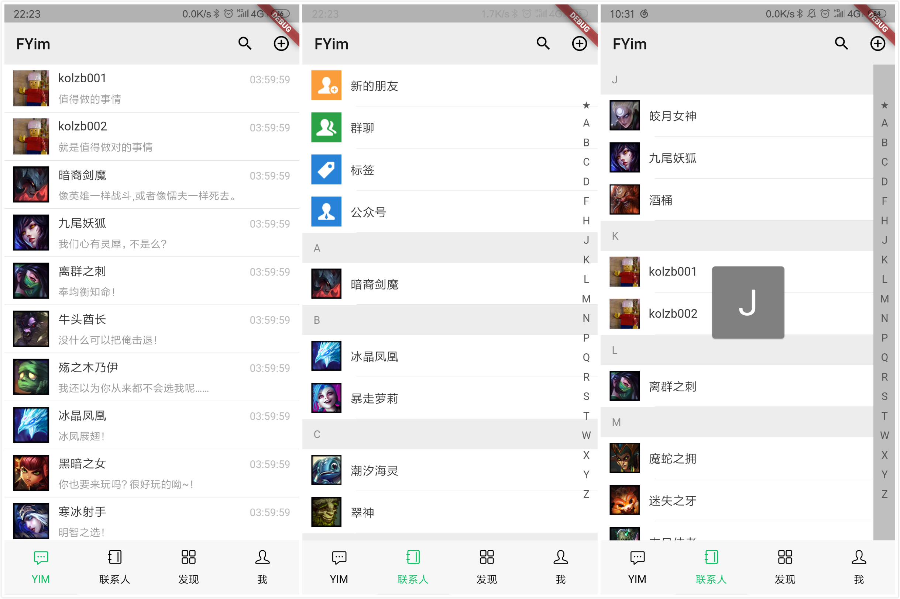
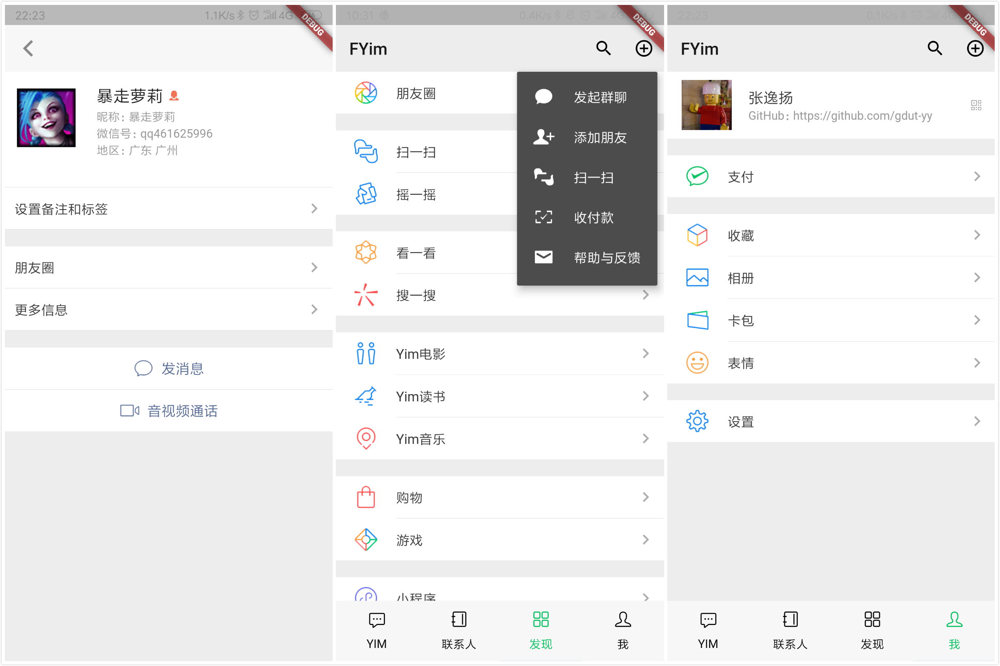
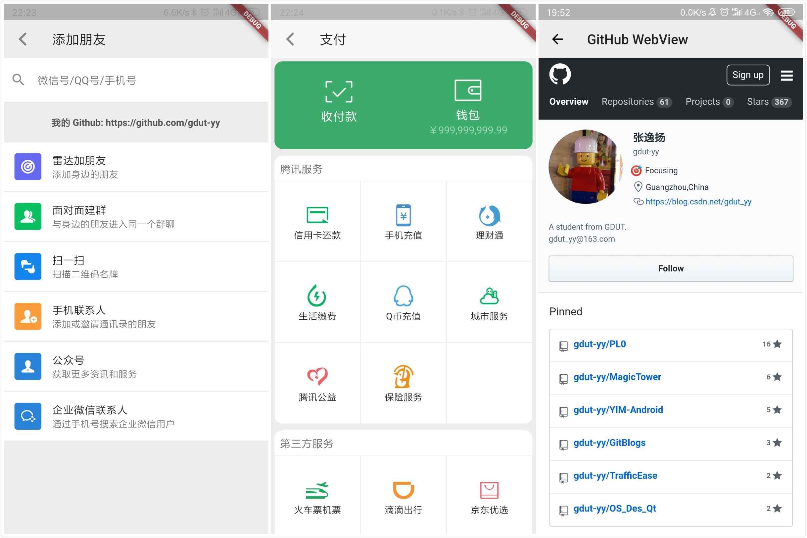
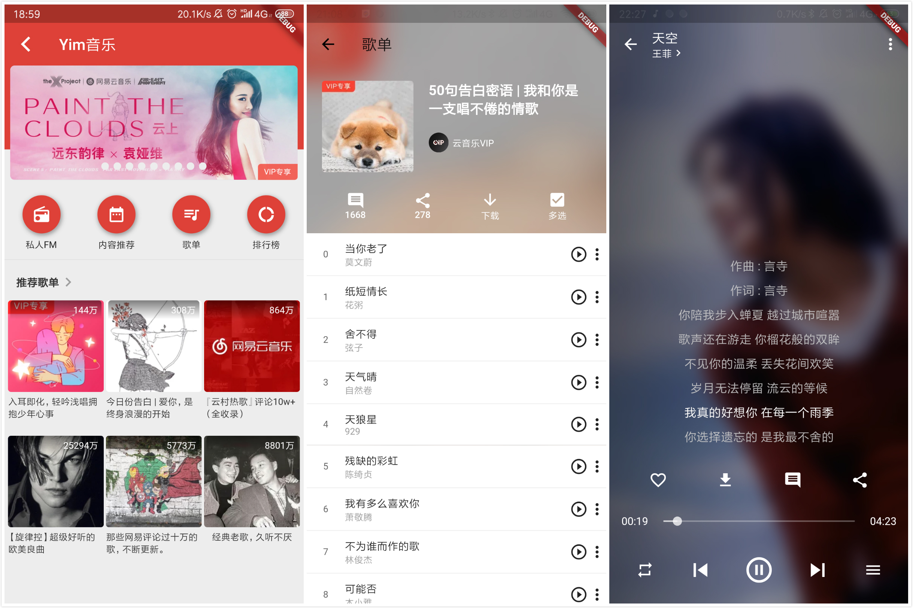

# OpenFlutterYim

## 毕设开源预告

FYim（flutter-yim）是本人基于 Flutter 技术开发的一款跨平台聊天社交应用，主要包含 IM（仿微信）、电影（仿豆瓣）、小说（仿书旗小说）、音乐（仿网易云音乐）四大模块。（Native？RN？Weex？Google I/O 2019 上 Flutter for Web 的发布预示 Flutter 或将成为全平台 UI 框架？）

在持续半年的开发过程中，历经 Flutter 版本从 1.0.0 升至 1.6.x，微信版本从 6.7.x 升至 7.0.x，书旗小说 API 改造，网易云音乐整体 UI 改造，Android 9 适配等各种坑…… 最坑的是，在答辩前一周时突然发现第三方  API 接口下线，不得不连夜 fork 出分支使用豆瓣 API 来救火……

BTW，感谢指导老师，感谢答辩老师，感谢阿里开源的 FlutterBoost 混合开发方案，感谢 GitHub 社区上给予过帮助的伙伴们。为更好地感谢和回馈开源社区，遂决定稍后将此项目开源。

## Git Branchs

- `0.0.1`：flutter_app Flutter 最初的样子，用于测试开发环境是否搭配成功。
- `0.1.0`：flutter_boost 项目测试，此分支后暂时只支持 android。
- `1.x`：module_movie、module_novel、module_cloud_music
- `2.x`：module_movie => module_douban

## Yim 主模块（仿微信）

## Yim 电影模块（仿豆瓣）

## Yim 小说模块（仿书旗小说）

## Yim 音乐模块（仿网易云音乐）
